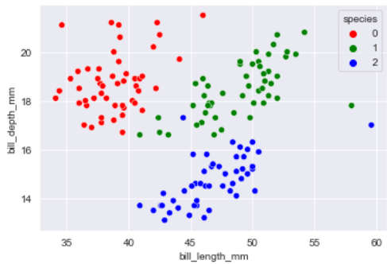
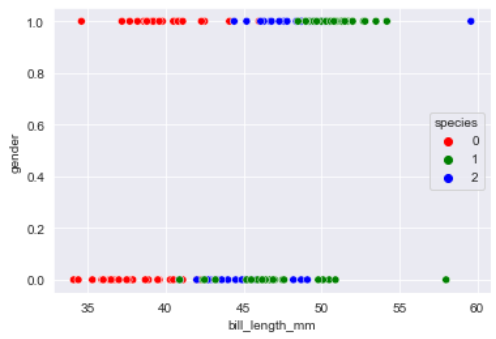
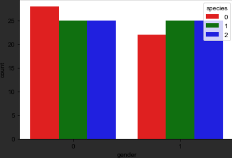

# Single Layer Perceptron Neural Network Implementation from Scratch with GUI

This repository contains an implementation of the Single layer perceptron neural network algorithm with a graphical user interface (GUI) for easy visualization and hyperparameter tuning. 

## Features

- Single layer perceptron neural network implementation
- Graphical user interface (GUI) for easy visualization and hyperparameter tuning
- Feature comparison tool

## Visualizations

Below are some visualizations of the performance of the Single layer perceptron neural network on various datasets:

## Usage

To use the Single layer perceptron neural network implementation and the GUI, follow these steps:

1. Clone this repository
2. Run `python main.py` to launch the GUI

## Acknowledgements

The implementation of the Single layer perceptron neural network algorithm is based on the work of Frank Rosenblatt, and the GUI is built using the tkinter library.

## References

- [Rosenblatt, F. (1958). "The perceptron: A probabilistic model for information storage and organization in the brain." Psychological Review, 65(6), 386–408.](https://psycnet.apa.org/record/1959-00617-001)
- [Tkinter documentation](https://docs.python.org/3/library/tkinter.html)

## Documentation

For more details on the implementation, usage and experimental results of the Single layer perceptron neural network, please see the documentation file: [Task1-report.docx](Task1-report.docx)
